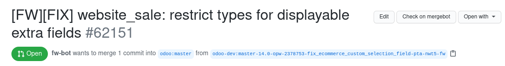

# What The Merge

What the merge is a Chrome/Firefox add-on that adds a button to GitHub's PR interface that directly sends the user to the mergebot dashboard of the corresponding PR, so that you can know exactly *what* is going on with *the merge* procedure.

## Todo

 - Hide the link by robodoo by default ?
 - Embed the information into the page / by hovering the button (perf? ddos?)

## Known issues

 - If a tab containing a PR is left open and someone adds a comment to said PR, the button will disappear. It would seem like GitHub rewrites the whole DOM when someone adds a comment on an open PR, meaning a listener must be added to rewrite the button whenever the DOM is updated.

 - Only works if one is currently logged in to GitHub AND has maintainer permissions, which is not really necessary
